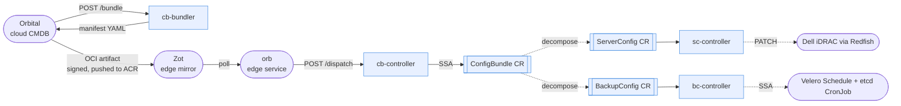

# 📦 configbundle

`ConfigBundle` is a Kubernetes CRD for cloud-authored, edge-enforced
configuration. This repo defines the CRD family (`ConfigBundle`,
`ServerConfig`, `BackupConfig`) plus four services that move intent from
Orbital's CMDB graph in the cloud to actuation on edge management clusters:
**cb-bundler**, **cb-controller**, **sc-controller** (iDRAC), **bc-controller**
(backups).

For project status, see [ROADMAP.md](./ROADMAP.md).

## Motivation

Modular data centers ship with intermittent or air-gapped network connectivity
and management clusters that cannot receive pushed configuration. Existing
tools assume persistent connectivity + a central controller that reconciles
downstream. That assumption breaks at the edge:

- **GitOps and pull-webhook patterns don't work** — the edge can't reach
  arbitrary git hosts and can't accept unsigned bytes from the network
- **Direct actuation from the cloud is unavailable** — no reliable push path
  exists into an air-gapped facility
- **Manual per-cluster reconciliation doesn't scale** — dozens of galleons,
  each with their own drift, quickly outgrows tribal knowledge

`configbundle` closes that gap by turning Orbital's intent graph into signed
OCI artifacts that edge clusters pull, verify, and reconcile locally.
Divergence flows back through the same pipe as a separate report — it's data,
not an error.

## Goals

- **Edge always pulls, cloud never pushes** — no cloud component initiates a
  connection to a Galleon
- **Signed intent, verified at the edge** — Orbital signs the ConfigBundle OCI
  artifact once; orb cosign-verifies before applying
- **CRD-native at the edge** — the ConfigBundle CR IS the handoff artifact;
  edge controllers reconcile from the CR
- **Divergence is data, not error** — local admin overrides surface upstream
  via a divergence report; orbital resolves each as accept / reject / ignore
- **Monorepo, one release cycle** — four services share types, share a
  Dockerfile, share a release cadence (cert-manager / cluster-api pattern)

## Reference architecture

<p align="center"><em>Blue components live in this repo. Everything else is
external — Orbital and orb (in the orbital repo) drive input, sibling
resources are downstream actuation targets.</em></p>



## Concepts

- **`ConfigBundle`** — top-level CRD. One CR per Galleon. Carries desired
  state for servers, iDRAC settings, Kubernetes cluster backup config, plus
  divergence directives from Orbital.
- **`ServerConfig`** — per-server child CR decomposed from `ConfigBundle`.
  Owned by `sc-controller`, which PATCHes iDRAC via Redfish.
- **`BackupConfig`** — per-cluster child CR. Owned by `bc-controller`, which
  reconciles a Velero Schedule + etcd snapshot CronJob to Azure Blob storage.
- **`cb-bundler`** — cloud-side HTTP service. Runs as an Orbital enricher.
  Reads Orbital's DGraph via GraphQL, produces the ConfigBundle manifest.
  Never pushes to a registry — Orbital owns signing and push.
- **`cb-controller`** — edge-side controller. Registered as a consumer with
  `orb` on `POST /dispatch`; applies the manifest as a ConfigBundle CR;
  decomposes into child CRs; reports divergence back to orb.
- **`orb`** — edge service (lives in the [orbital repo](../orbital)). Polls
  Zot for new bundle tags, cosign-verifies, imports graph data to local
  DGraph, dispatches remaining layers to registered consumers by media type.
- **`divergence`** — delta between orbital intent and observed edge state.
  Produced by cb-controller, forwarded to orb → orbital. Data, not error.
- **`local:admin` override** — SSA field manager string used when an operator
  applies a manual field-level change against the edge CR. Preserved and
  surfaced upstream as divergence.

---

## Quick Start

Get from clone to end-to-end reconcile in ~5 minutes.

### Prerequisites

```bash
brew install go@1.26 kubectl kustomize kubebuilder minikube docker
brew install --cask docker    # if you don't already have a Docker runtime
```

Verify:

```bash
go version              # go 1.26.4 or later
docker --version
minikube version
kubectl version --client
```

### 1. Start local Kubernetes + install CRDs

```bash
make up
```

Starts minikube if it isn't already running, installs the three CRDs
(`configbundles.armada.ai`, `serverconfigs.armada.ai`, `backupconfigs.armada.ai`).

Verify:

```bash
kubectl get crd | grep armada.ai
```

### 2. Run cb-controller

In one terminal:

```bash
make run-controller
```

- Health: `http://localhost:8091/healthz`
- Dispatch (from orb): `http://localhost:8095/dispatch`

### 3. Apply the sample and watch decomposition

In another terminal:

```bash
kubectl apply -f config/samples/v1_configbundle.yaml
```

Verify all three CR layers exist:

```bash
kubectl get configbundles
kubectl get serverconfigs.armada.ai
kubectl get backupconfigs
```

Each should show one CR. cb-controller decomposed the parent into a
`ServerConfig` (name derived from hostname) and a `BackupConfig` (name derived
from ClusterBackup orbId).

### 4. Run tests

```bash
make test
```

Unit + envtest, no cluster required. ~30 seconds. All packages should be green.

### 5. Clean up

```bash
kubectl delete configbundle colo-galleon
make down   # stop minikube
```

Cascade delete removes child CRs; `make down` stops minikube.

### Troubleshooting

**`make up` fails on minikube start.**
`minikube delete && minikube start --driver=docker` and retry.

**`make test` fails with "envtest binaries not found".**
`make setup-envtest`. Usually only needed after a Go toolchain upgrade.

**`kubectl` context is wrong.**
`kubectl config current-context` should say `minikube` for local dev. Edge
work uses a different KUBECONFIG — see
[`docs/playbooks/deploy-to-edge.md`](docs/playbooks/deploy-to-edge.md).

**Pods stuck `ImagePullBackOff` on colo-dev-main.**
`az acr login --name armadaeksatest` before `make push-*`.

---

## Optional: sibling controllers (sc, bc)

Only needed if you're exercising iDRAC or backup paths.

```bash
# sc-controller — iDRAC reconciler. Empty allowlists = starts safely.
IDRAC_OOB_ALLOWLIST="" IDRAC_FIELD_ALLOWLIST="" make run-serverconfig

# bc-controller — Velero Schedule + etcd CronJob reconciler
make run-backupconfig

# cb-bundler — only if testing the orbital → bundler path
make run-bundler
```

---

## Where to go next

**Building a feature or fixing a bug** → [CONTRIBUTING.md](./CONTRIBUTING.md) —
PR workflow, tests, code style, release process, AI-assistant conventions.

**Understanding a specific domain** — each topic doc includes a
`## Settled Decisions` section with the rules and rationale for that area:

| Working on | Read |
|---|---|
| Bundler HTTP service, enricher API, Orbital GraphQL integration | [`docs/reference/API.md`](docs/reference/API.md) |
| OCI artifact structure, layers, media types, signing, tags | [`docs/reference/BUNDLE.md`](docs/reference/BUNDLE.md) |
| CRD types, kubebuilder annotations, SSA semantics | [`docs/reference/CRD.md`](docs/reference/CRD.md) |
| bc-controller, etcd/Velero backups, backup status + metrics | [`docs/reference/BACKUP.md`](docs/reference/BACKUP.md) |
| Edge dispatch, cosign, divergence, reclaim, handback | [`docs/reference/EDGE.md`](docs/reference/EDGE.md) |
| Orbital GraphQL data model, override semantics | [`docs/reference/ORBITAL.md`](docs/reference/ORBITAL.md) |

**Doing a specific task** — playbook:

| Task | Playbook |
|---|---|
| Add a new field to a CRD | [`docs/playbooks/add-crd-field.md`](docs/playbooks/add-crd-field.md) |
| Cut and push a new version | [`docs/playbooks/tag-and-release.md`](docs/playbooks/tag-and-release.md) |
| Deploy to the colo-dev-main edge cluster | [`docs/playbooks/deploy-to-edge.md`](docs/playbooks/deploy-to-edge.md) |

**Troubleshooting** — runbook:

| Symptom | Runbook |
|---|---|
| BackupConfig CR exists but no CronJob was created | [`docs/runbooks/backupconfig-not-reconciling.md`](docs/runbooks/backupconfig-not-reconciling.md) |

---

## Repository layout

```
api/v1/                     CRD types
bundle/                     OCI media type constants
cmd/
  controller/main.go        cb-controller entry
  bundler/main.go           cb-bundler entry
  serverconfig/main.go      sc-controller entry
  backupconfig/main.go      bc-controller entry
internal/
  controller/               cb-controller logic
  bundler/                  cb-bundler logic
  serverconfig/             sc-controller logic
  backupconfig/             bc-controller logic
config/                     Kubebuilder / kustomize manifests
docs/
  reference/*.md            topic docs with inline "## Settled Decisions"
  examples/                 sample manifests
  playbooks/                task-focused how-tos
  runbooks/                 operational troubleshooting
  research/                 investigation notes
test/                       e2e tests
```

## Stack

- **Language:** Go 1.26.4, module `github.com/armada/configbundle`
- **Framework:** kubebuilder / controller-runtime
- **Kubernetes:** client-go, envtest, Ginkgo v2
- **Registries:** ACR (cloud, Orbital pushes), Zot (edge mirror, orb pulls).
  This repo holds **no** OCI write credentials — Orbital is the sole producer.

## Related projects

- **[orbital](../orbital)** — Cloud CMDB (GraphQL, DGraph, OCI signing/push) +
  `orb` edge service. Configbundle sits between the two as data + delivery.
