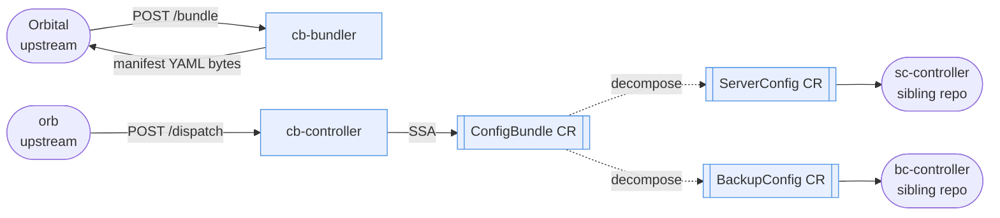

# configbundle

`ConfigBundle` is a Kubernetes CRD for cloud-authored, edge-enforced configuration. This repo defines the CRD family (`ConfigBundle`, `ServerConfig`, `BackupConfig`) and the two services that produce and consume it: **cb-bundler**, which reads Orbital's CMDB graph and materializes it as a ConfigBundle manifest, and **cb-controller**, which runs at the edge — inside a modular data center's management cluster — and reconciles the manifest into per-domain child CRs.

For project status, see [`ROADMAP.md`](ROADMAP.md).

## What is this

- **`ConfigBundle`** is the CRD that carries one data center's intent — servers, iDRAC settings, backup schedules, and local override / divergence state — as a single Kubernetes resource.
- **Orbital** is the cloud CMDB (GraphQL over DGraph) that authors the intent. See the [orbital repo](../orbital/README.md) for its design.
- **`cb-bundler`** and **`cb-controller`** are the two ends of the delivery pipeline — bundler cloud-side, controller edge-side. Both live in this repo; both operate on the same CRD schema this repo defines.

## Why

Modular data centers are often air-gapped or intermittently connected. Their management clusters can't receive pushed config, and they can't trust unsigned bytes from the network. Together those constraints rule out most GitOps and pull-webhook patterns.

`configbundle` solves this with a two-part contract:

1. **Cloud side.** `cb-bundler` runs as an Orbital enricher: Orbital's export pipeline POSTs to `bundler:/bundle`, receives back the ConfigBundle manifest, signs the full artifact once, and pushes it to a registry. Orbital owns signing and push; the bundler contributes one layer.
2. **Edge side.** `cb-controller` runs on the edge management cluster as a passive consumer. It never polls a registry and never talks to the cloud. `orb` (the edge service) pulls from the local Zot mirror, cosign-verifies, imports graph data to DGraph, then dispatches the manifest layer over HTTP to `cb-controller` via `POST /dispatch`. `cb-controller` applies the ConfigBundle CR, decomposes it into per-domain child CRs, and reports divergence back to `orb`.

See [`docs/claude/edge-context.md`](docs/claude/edge-context.md) for the end-to-end sequence diagram.

## What this repo owns

For the full delivery pipeline (Orbital → OCI signing → ACR → Zot mirror → orb → edge), see the reference architecture in the [orbital README](../orbital/README.md#reference-architecture).

Within that pipeline, `configbundle` owns two services and one CRD family:



Blue = owned by this repo. Everything else is an external boundary — Orbital calls the bundler, orb calls the controller, sibling controllers watch the child CRs.

**The cardinal invariant:** the edge always pulls; the cloud never initiates a connection to the edge.

## Repos in this system

| Repo | Role |
|---|---|
| `~/armada/configbundle` (this repo) | ConfigBundle CRD types, cb-bundler service, cb-controller |
| `~/armada/orbital` | Cloud CMDB (GraphQL, DGraph, OCI signing/push) + orb edge service |
| `~/armada/serverconfig-controller` | Sibling controller: watches ServerConfig CRs, PATCHes iDRAC via Redfish |
| `~/armada/backupconfig-controller` | Sibling controller: watches BackupConfig CRs, SSA-patches Velero Schedule + etcd CronJob |

The two sibling controllers import CRD types from this repo (`github.com/armada/configbundle/api/v1`) via a `replace` directive in their `go.mod`. If you're editing the CRD schema for ServerConfig or BackupConfig, that happens **here**, not in the sibling repos.

## Running locally

Full local dev needs three terminals: minikube + this repo's controller and bundler. Orbital can be mocked or run in the sibling repo depending on what you're testing.

```bash
# Terminal 0 — start minikube and install CRDs
make up

# Terminal 1 — cb-controller (:8091 health, :8095 dispatch)
make run-controller

# Terminal 2 — cb-bundler (:8020) — only needed if testing the enricher path
make run-bundler
```

`make up` starts minikube if it isn't running, installs the CRDs, and prints the follow-up commands. `make down` stops minikube.

For full pipeline testing (orbital → OCI → orb → cb-controller), you need the orbital repo running too. See [`docs/edge-deploy.md`](docs/edge-deploy.md) for edge deployment and the [orbital repo](../orbital) for its own dev commands.

## Testing

```bash
make test              # unit + envtest (in-process API server; no cluster required)
make test-e2e-local    # e2e against `make run-controller` on minikube
make test-e2e          # full CI path: build image, Kind cluster, kustomize deploy
```

`make test` covers:

- **CRD decomposition** — ConfigBundle → ServerConfig, ConfigBundle → BackupConfig, all leaf fields propagated, cross-CR ownerReferences
- **Desired state enforcement** — out-of-band mutations on child CRs are restored via `Owns()` watch
- **Spec updates** propagate parent → child
- **ConsumeServer apply pipeline** — idempotency, admin-override bow-out (`omitAdminOwnedFields`), takeover, ignored, stale-filter
- **Divergence reporter** — debounce, heartbeat, bootstrap rehydration from persistent ConfigMap, cold-start guard
- **Reclaim controller** — event-driven replay after local:* release, in-flight guard
- **Bundler** — GraphQL mapping, takeover/ignored resolution lookup, cluster backup mapping

`make test-e2e-local` adds cascade-delete verification and full-controller behavior tests.

## Documentation map

The README is intentionally thin. Detailed context lives in structured domain files.

- [`CLAUDE.md`](CLAUDE.md) — top-level navigation, settled cross-cutting decisions, working conventions
- [`ROADMAP.md`](ROADMAP.md) — spike register, recent accomplishments, upcoming priorities
- [`CONTRIBUTING.md`](CONTRIBUTING.md) — commit conventions, PR process, review expectations
- [`AGENTS.md`](AGENTS.md) — AI agent guide (kubebuilder layout, code-gen rules)

**Domain reference files** (read the one that matches what you're touching):

| Working on | Read |
|---|---|
| Bundler HTTP service, enricher API, Orbital GraphQL integration | [`docs/claude/api-context.md`](docs/claude/api-context.md) |
| OCI artifact structure, layers, media types, signing, tags | [`docs/claude/bundle-context.md`](docs/claude/bundle-context.md) |
| CRD types, kubebuilder annotations, SSA semantics | [`docs/claude/crd-context.md`](docs/claude/crd-context.md) |
| Edge dispatch pipeline, cosign, divergence, reclaim, handback | [`docs/claude/edge-context.md`](docs/claude/edge-context.md) |
| Orbital GraphQL data model, override semantics, ConfigBundle YAML | [`docs/claude/orbital-context.md`](docs/claude/orbital-context.md) |

**Decision records** — architecture decisions with full rationale. See [`docs/decisions/`](docs/decisions/). Load when the context isn't visible from the code.

**Deployment** — see [`docs/edge-deploy.md`](docs/edge-deploy.md) for kustomize-based deploy to the edge management cluster.

## Repository layout

```
api/v1/                     CRD type definitions (ConfigBundle, ServerConfig, BackupConfig)
bundle/                     OCI media type constants
cmd/                        Entry points: main.go (controller), bundler/main.go (enricher)
internal/bundler/           Enricher HTTP service (POST /bundle)
internal/controller/        Controller logic — consume, decompose, divergence, reclaim, takeover
config/                     Kubebuilder / kustomize manifests
docs/                       Domain reference files, ADRs, deploy guides
test/                       e2e tests
```

## Stack

- **Language:** Go 1.25.5, module `github.com/armada/configbundle`
- **Framework:** kubebuilder / controller-runtime
- **Kubernetes:** client-go, envtest, Ginkgo v2
- **Registries:** ACR (cloud, Orbital pushes), Zot (edge mirror, orb pulls). This repo holds **no** OCI write credentials — Orbital is the sole producer.

