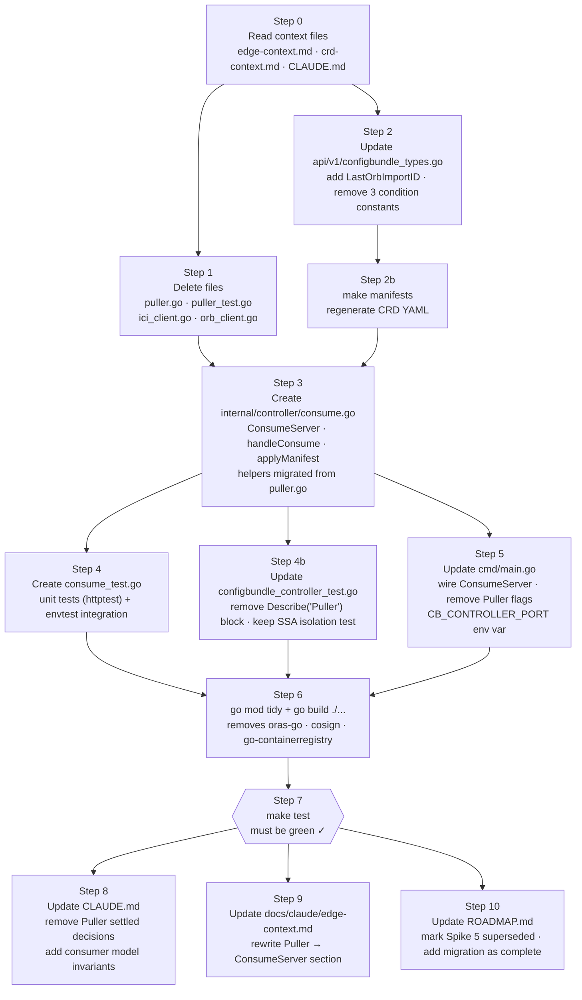

# CB Controller Consumer Migration — Execution Plan

This document is the step-by-step implementation guide for migrating CB Controller from
the Puller (OCI pull model) to the ConsumeServer (orb dispatch model).

**Architectural source of truth:** `docs/configbundle-integration.md` in the orbital repo  
**Migration plan:** `docs/cb-controller-consumer-plan.md` in this repo

---

## What This Migration Does

Replaces the `Puller` ctrl.Runnable (which polled Zot, cosign-verified, extracted layers,
called orb's import API, then SSA-applied the ConfigBundle CR) with a `ConsumeServer`
ctrl.Runnable that exposes `POST /consume` and receives the manifest layer directly from
orb's dispatch pipeline.

CB Controller no longer needs: OCI registry credentials, oras-go, cosign, or knowledge
of the artifact format. The existing SSA apply pipeline (parse → omitAdminOwnedServers →
SSA patch → status update) is unchanged; it's triggered by HTTP push instead of a timer.

---

## Execution DAG



**Critical path:** 0 → 2 → 2b → 3 → 4 → 6 → 7 → 8

**Checkpoint:** build must pass after Step 6. Do not update docs (8–10) until Step 7 is green.

---

## Step 0 — Read Before Starting

Load these context files:
- `docs/claude/edge-context.md`
- `docs/claude/crd-context.md`
- `CLAUDE.md` (settled decisions section)

Key constraints that must survive this migration:
- `omitAdminOwnedServers` + `adminOwnedServiceTags` logic is **mandatory** in the consume
  apply path — the consume handler is a new trigger for the existing pipeline, not a
  simpler replacement
- SSA patches use field owner `"configbundle-controller"` — unchanged
- Apply WITHOUT ForceOwnership — unchanged
- `+listType=map +listMapKey=serviceTag` on `servers[]` — unchanged, already in the CRD

---

## Step 1 — Delete Files

Delete these files entirely (git history is preserved):

```
internal/controller/puller.go
internal/controller/puller_test.go
internal/controller/oci_client.go
internal/controller/orb_client.go
```

---

## Step 2 — Update `api/v1/configbundle_types.go`

**Remove** the three condition constants that are now orb's responsibility:
```go
// DELETE these three:
ConditionArtifactFetched  = "ArtifactFetched"
ConditionSignatureVerified = "SignatureVerified"
ConditionGraphImported    = "GraphImported"
// KEEP:
ConditionReconciled = "Reconciled"
```

**Add** `LastOrbImportID` to `ConfigBundleStatus`:
```go
// LastOrbImportID is the orb import UUID from the X-Orb-Import-ID header of the
// most recent successful consume dispatch. Used for correlation with orb import history.
// +optional
LastOrbImportID string `json:"lastOrbImportID,omitempty"`
```

Update the `LastAppliedDigest` comment — it is now set from the `X-Orb-Digest` header,
not from the OCI pull.

Run `make manifests` after this step to regenerate CRD YAML.

---

## Step 3 — Create `internal/controller/consume.go`

This file contains:
1. `ConsumeServer` struct + functional options
2. `POST /consume` HTTP handler
3. `applyManifest` — the full apply pipeline with retry
4. Helpers migrated from the deleted `puller.go`: `parseManifest`,
   `omitAdminOwnedServers`, `adminOwnedServiceTags`, `setCondition`

### 3a — ConsumeServer with functional options

```go
const (
    defaultPort        = ":8095"
    defaultRetryMax    = 3
    defaultRetryWait   = time.Second
    maxManifestBytes   = 10 * 1024 * 1024 // 10 MB — matches ORBITAL_ENRICHER_MAX_RESPONSE_BYTES
)

type ConsumeServer struct {
    Client    client.Client
    port      string
    namespace string
    retryMax  int
    retryWait time.Duration
}

type ConsumeServerOption func(*ConsumeServer)

func WithPort(port string) ConsumeServerOption {
    return func(s *ConsumeServer) { s.port = port }
}

func WithNamespace(ns string) ConsumeServerOption {
    return func(s *ConsumeServer) { s.namespace = ns }
}

// WithRetry configures apply retry. maxAttempts is the total number of attempts
// (1 = no retry). backoffBase is the wait before the second attempt; each subsequent
// attempt doubles it (exponential backoff).
func WithRetry(maxAttempts int, backoffBase time.Duration) ConsumeServerOption {
    return func(s *ConsumeServer) {
        s.retryMax  = maxAttempts
        s.retryWait = backoffBase
    }
}

func NewConsumeServer(c client.Client, opts ...ConsumeServerOption) *ConsumeServer {
    s := &ConsumeServer{
        Client:    c,
        port:      defaultPort,
        namespace: "configbundle-system",
        retryMax:  defaultRetryMax,
        retryWait: defaultRetryWait,
    }
    for _, opt := range opts {
        opt(s)
    }
    return s
}

// NeedsLeaderElection returns false — all replicas serve /consume.
// SSA patches from the same field owner are idempotent; concurrent applies are safe.
func (s *ConsumeServer) NeedsLeaderElection() bool { return false }
```

### 3b — Start (ctrl.Runnable)

```go
func (s *ConsumeServer) Start(ctx context.Context) error {
    logger := log.FromContext(ctx).WithName("consume-server")
    mux := http.NewServeMux()
    mux.HandleFunc("POST /consume", s.handleConsume)
    srv := &http.Server{Addr: s.port, Handler: mux}

    go func() {
        <-ctx.Done()
        shutdownCtx, cancel := context.WithTimeout(context.Background(), 5*time.Second)
        defer cancel()
        _ = srv.Shutdown(shutdownCtx)
    }()

    logger.Info("starting consume server", "port", s.port)
    if err := srv.ListenAndServe(); err != nil && !errors.Is(err, http.ErrServerClosed) {
        return fmt.Errorf("consume server: %w", err)
    }
    return nil
}
```

### 3c — handleConsume

```go
func (s *ConsumeServer) handleConsume(w http.ResponseWriter, r *http.Request) {
    logger := log.FromContext(r.Context()).WithName("consume")

    mediaType := r.Header.Get("Content-Type")
    if mediaType != bundle.MediaTypeManifest {
        http.Error(w, "unsupported media type", http.StatusUnsupportedMediaType)
        return
    }

    tag      := r.Header.Get("X-Orb-Tag")
    digest   := r.Header.Get("X-Orb-Digest")
    importID := r.Header.Get("X-Orb-Import-ID")

    body, err := io.ReadAll(io.LimitReader(r.Body, maxManifestBytes))
    if err != nil {
        http.Error(w, "read body: "+err.Error(), http.StatusInternalServerError)
        return
    }
    if int64(len(body)) == maxManifestBytes {
        http.Error(w, "manifest exceeds max size", http.StatusRequestEntityTooLarge)
        return
    }

    logger.Info("received dispatch",
        "mediaType", mediaType, "tag", tag, "digest", digest,
        "importID", importID, "bytes", len(body),
    )

    if err := s.applyManifest(r.Context(), body, digest, importID); err != nil {
        logger.Error(err, "apply manifest failed", "importID", importID)
        // 500 so orb's import history records the failure.
        // REVISIT: if orb adds retry semantics on dispatch, a transient apply failure
        // here will cause orb to retry — which is correct. Until then, a 500 means
        // the manifest is not applied until the next import is triggered manually.
        http.Error(w, "apply failed: "+err.Error(), http.StatusInternalServerError)
        return
    }

    w.WriteHeader(http.StatusOK)
}
```

### 3d — applyManifest

```go
func (s *ConsumeServer) applyManifest(ctx context.Context, body []byte, digest, importID string) error {
    spec, err := parseManifest(body)
    if err != nil {
        return fmt.Errorf("parse manifest: %w", err)
    }
    if spec.Datacenter == "" {
        return fmt.Errorf("manifest has empty datacenter field")
    }

    // Fetch the current CR to read managedFields (for omitAdminOwnedServers).
    var cb armadav1.ConfigBundle
    err = s.Client.Get(ctx, types.NamespacedName{
        Name:      spec.Datacenter,
        Namespace: s.namespace,
    }, &cb)
    if client.IgnoreNotFound(err) != nil {
        return fmt.Errorf("get ConfigBundle: %w", err)
    }

    patchSpec := omitAdminOwnedServers(spec, cb.ManagedFields)

    apply := &armadav1.ConfigBundle{
        TypeMeta: metav1.TypeMeta{
            APIVersion: armadav1.GroupVersion.String(),
            Kind:       "ConfigBundle",
        },
        ObjectMeta: metav1.ObjectMeta{
            Name:      spec.Datacenter,
            Namespace: s.namespace,
        },
        Spec: patchSpec,
    }

    // Retry with exponential backoff on transient K8s API errors.
    var lastErr error
    for attempt := 0; attempt < s.retryMax; attempt++ {
        if attempt > 0 {
            wait := s.retryWait * (1 << (attempt - 1)) // 1s, 2s, 4s, ...
            select {
            case <-ctx.Done():
                return fmt.Errorf("apply cancelled after %d attempts: %w", attempt, ctx.Err())
            case <-time.After(wait):
            }
        }
        lastErr = s.Client.Patch(ctx, apply, client.Apply,
            client.FieldOwner("configbundle-controller"),
        )
        if lastErr == nil {
            break
        }
    }
    if lastErr != nil {
        return fmt.Errorf("apply ConfigBundle spec (after %d attempts): %w", s.retryMax, lastErr)
    }

    // Re-fetch for status update (need latest resourceVersion).
    if err := s.Client.Get(ctx, types.NamespacedName{
        Name:      spec.Datacenter,
        Namespace: s.namespace,
    }, &cb); err != nil {
        return fmt.Errorf("re-get ConfigBundle for status update: %w", err)
    }

    now := metav1.Now()
    cb.Status.LastAppliedDigest = digest
    cb.Status.LastOrbImportID   = importID
    cb.Status.LastAppliedAt     = &now
    setCondition(&cb.Status.Conditions, armadav1.ConditionReconciled,
        metav1.ConditionTrue, "Reconciled", "manifest applied via orb dispatch")

    if err := s.Client.Status().Update(ctx, &cb); err != nil {
        return fmt.Errorf("update ConfigBundle status: %w", err)
    }

    return nil
}
```

### 3e — Migrate helpers from deleted puller.go

Copy these functions verbatim from the deleted `puller.go` into `consume.go`:
- `parseManifest`
- `omitAdminOwnedServers`
- `adminOwnedServiceTags`
- `setCondition`

---

## Step 4 — Create `internal/controller/consume_test.go`

### Unit tests (net/http/httptest — no K8s)

Use a `fakeApplier` that captures the body and returns a configurable error.
Test table via standard `testing.T`.

| Test case | Input | Assert |
|---|---|---|
| `ValidManifest` | correct Content-Type, valid YAML body | 200, applier called |
| `WrongMediaType` | `Content-Type: application/json` | 415 |
| `OversizedBody` | body > maxManifestBytes | 413 |
| `BadYAML` | correct Content-Type, invalid YAML | 400 |
| `ApplierError` | applier returns error | 500 |
| `EmptyDatacenter` | manifest YAML with `datacenter: ""` | 400 |

Note: unit tests inject a fake applier via an `applier` interface on `ConsumeServer`
(or test the handler directly by pointing `applyManifest` at a mock). See below.

For handler-level unit tests, expose an `applyFn` field so tests can replace
`applyManifest`:
```go
// applyFn is the apply function. Non-nil only in tests — production uses applyManifest.
applyFn func(ctx context.Context, body []byte, digest, importID string) error
```
The handler calls `s.applyFn` if non-nil, else `s.applyManifest`.

### Envtest integration tests (Ginkgo — real K8s API)

Add a new `Describe("ConsumeServer")` block in `configbundle_controller_test.go`.

Tests call `server.applyManifest(ctx, body, digest, importID)` directly (same pattern
as the old `puller.RunCycle`) — this exercises the full K8s apply path without needing
an actual HTTP server.

| Test | Asserts |
|---|---|
| Valid manifest → CR created | `spec.servers` correct; `status.lastAppliedDigest` = digest arg; `status.lastOrbImportID` = importID arg; `Reconciled=True` |
| Same body dispatched twice | No error; CR unchanged (idempotent) |
| Admin-owned server in manifest | Admin entry preserved; other entries applied (reuses existing SSA isolation logic) |
| Manifest with no servers | CR created with empty servers |
| Empty datacenter field | Returns error — no CR created |

**Remove** the existing `Describe("Puller")` block entirely.  
**Keep** the existing `Describe("SSA list merge-key isolation on servers[]")` test — it
tests the CRD annotation, not the Puller.

---

## Step 5 — Update `cmd/main.go`

**Remove:**
- `var enablePuller bool` and its `flag.BoolVar`
- `var enableOrbImport bool` and its `flag.BoolVar`
- The entire Puller wiring block (`if !enablePuller { ... } else if datacenter := ...`)
- Unused imports: `"time"` (if no longer used elsewhere)

**Add:**
```go
consume := controller.NewConsumeServer(mgr.GetClient(),
    controller.WithPort(envOrDefault("CB_CONTROLLER_PORT", ":8095")),
    controller.WithNamespace(envOrDefault("NAMESPACE", "configbundle-system")),
)
if err := mgr.Add(consume); err != nil {
    setupLog.Error(err, "Failed to register ConsumeServer")
    os.Exit(1)
}
setupLog.Info("ConsumeServer registered", "port", envOrDefault("CB_CONTROLLER_PORT", ":8095"))
```

Env vars now used in main.go:
- `CB_CONTROLLER_PORT` (default `:8095`) — consume endpoint
- `NAMESPACE` (default `configbundle-system`) — ConfigBundle CR namespace

---

## Step 6 — Clean Up Dependencies

Run:
```
go mod tidy
```

This removes: `oras.land/oras-go/v2`, `github.com/sigstore/cosign/v2`,
`github.com/google/go-containerregistry`, `github.com/sigstore/sigstore`.

Verify with `go build ./...` before running tests.

---

## Step 7 — Run Tests

```
make test
```

All tests must pass. Coverage should be comparable to or better than the pre-migration
baseline (~61%). The deleted Puller envtest block will be replaced by the ConsumeServer
envtest block — coverage delta should be neutral or positive.

---

## Step 8 — Update CLAUDE.md

**Remove from Settled Decisions:**
- "Puller stays in the ConfigBundle Controller binary for MVP"
- "Puller does not force-override local fields"
- "Puller calls orb `POST /import/subgraph` before writing the ConfigBundle CR"
- "Orb does not poll Zot"
- "`ORB_ENDPOINT` env var"
- "`--enable-puller` / `--enable-orb-import` flags"

**Add to Settled Decisions:**
- "Orb is the single artifact ingress at the edge. CB Controller is a registered
  consumer. CB Controller never pulls from ACR and never needs OCI credentials."
- "CB Controller exposes `POST /consume` on `CB_CONTROLLER_PORT` (default `:8095`).
  No auth — protect via K8s NetworkPolicy."
- "The `omitAdminOwnedServers` + SSA conflict avoidance pipeline is mandatory in the
  consume apply path. The consume handler is a trigger, not a simpler replacement."
- "CB Controller returns 500 on apply failure so orb's import history records it.
  **Revisit** if orb adds retry semantics on its dispatch side."

**Update Current State section.**

---

## Step 9 — Update `docs/claude/edge-context.md`

- Rewrite the Puller section → ConsumeServer
- Remove references to Zot polling, OCI pull, cosign verification, orb import API call
- Update env vars table: remove `EDGE_REGISTRY_URL`, `COSIGN_PUBLIC_KEY_PATH`,
  `POLL_INTERVAL`, `ORB_ENDPOINT`, `DATACENTER`; add `CB_CONTROLLER_PORT`
- Update the "What CB Controller does on each dispatch" steps:
  1. Receive `POST /consume` from orb
  2. Validate `Content-Type`
  3. Parse manifest YAML → `ConfigBundleSpec`
  4. Fetch current CR → inspect `managedFields` → `omitAdminOwnedServers`
  5. SSA patch without ForceOwnership, field owner `"configbundle-controller"`
  6. Update status: `LastAppliedDigest`, `LastOrbImportID`, `LastAppliedAt`, `Reconciled=True`

---

## Step 10 — Update `ROADMAP.md`

- Mark Spike 5 as superseded by the consumer migration (not deleted — it's correct
  history that the Puller was built and then replaced)
- Add consumer migration as a completed item with date

---

## Known Trade-Offs / Decisions Recorded Here

| Decision | Rationale | Revisit trigger |
|---|---|---|
| `POST /consume` returns 500 on apply failure | Errors must be visible in orb import history; silent 200 would hide real failures | If orb adds retry on dispatch: a 500 will trigger retry, which is correct. Until then, re-run the import manually. |
| Sync apply (not async) | SSA patches are sub-second; async adds queue + error propagation complexity for no MVP benefit | If apply operations become slow (e.g., large manifests, slow kube-apiserver) |
| `NeedsLeaderElection() = false` | All replicas can safely serve `/consume`; SSA from the same field owner is idempotent | If apply state must be strictly serialised (not currently required) |
| Retry is exponential backoff in-process | No extra dependency; K8s API errors are transient by nature | If retry needs to survive pod restarts (persistent queue) |
