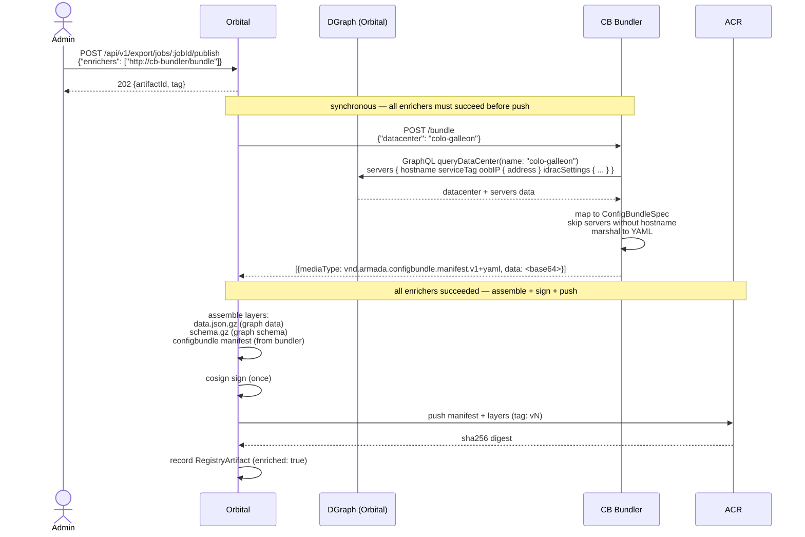

# API Reference

> **When to load this file:** Read this before working on the bundler HTTP service, the `POST /bundle` endpoint, or any Orbital GraphQL integration.


---

## Overview

The configbundle bundler exposes a single HTTP endpoint (`POST /bundle`) that Orbital calls synchronously during its publish pipeline. The bundler queries Orbital's GraphQL API, builds a ConfigBundle manifest, and returns the encoded layer bytes. The bundler is stateless — it holds no OCI credentials and never pushes to ACR.

---

## Bundler flow



**Failure path:** if `POST /bundle` returns non-2xx or times out, Orbital retries up to `ORBITAL_ENRICHER_MAX_ATTEMPTS` times (default 3, exponential backoff 1s–10s). If all attempts fail, the publish job is marked failed, nothing is pushed to ACR, and `enricher_error` is recorded.

---

## Key decisions

- **Single endpoint** — `POST /bundle` only. No other routes. No health check beyond 2xx on bundle.
- **Stateless** — no database, no persistent state; all data fetched from Orbital GraphQL per request.
- **Fail fast** — any error (GraphQL failure, timeout, bad datacenter) returns non-2xx immediately. Orbital treats non-2xx as a publish failure and retries per `ORBITAL_ENRICHER_MAX_ATTEMPTS`.
- **Auth is caller's concern** — the bundler does not issue tokens; it optionally attaches `ORBITAL_BEARER_TOKEN` as a bearer token on GraphQL requests. Empty = no auth header.

---

## Enricher API contract

### Request (Orbital → bundler)

```
POST /bundle
Content-Type: application/json

{
  "datacenter": "colo-galleon"
}
```

`datacenter` matches `DataCenter.name` in Orbital's DGraph schema.

For request tracing, callers may pass `X-Request-ID` as a header — the bundler logs it if present.

### Response (bundler → Orbital)

```json
[
  {
    "mediaType": "application/vnd.armada.configbundle.manifest.v1+yaml",
    "data": "<standard base64-encoded manifest bytes>"
  }
]
```

- `data` is standard base64 (not URL-safe)
- Empty array `[]` is valid — enricher ran but produced no layers
- Timeout default: 30s (configured on Orbital side via `ORBITAL_ENRICHER_TIMEOUT`)

### Go types

```go
type bundleRequest struct {
    Datacenter string `json:"datacenter"`
}

type layer struct {
    MediaType string `json:"mediaType"`
    Data      string `json:"data"` // standard base64
}
```

---

## Environment variables (bundler)

| Variable | Default | Description |
|---|---|---|
| `BUNDLER_PORT` | `8020` | HTTP listen port |
| `ORBITAL_GRAPHQL_URL` | `http://localhost:8001/graphql` | Orbital GraphQL endpoint |
| `ORBITAL_API_URL` | `http://localhost:8001` | Orbital REST API base (pending-force resolutions) |
| `ORBITAL_OIDC_ISSUER_URL` | `https://login.microsoftonline.com/{tenant}/v2.0` | OIDC issuer; token URL derived from this |
| `ORBITAL_OIDC_CLIENT_ID` | `{orbital app client ID}` | OAuth2 client ID (same as orbital's) |
| `ORBITAL_OIDC_CLIENT_SECRET` | `""` | OAuth2 client secret — set this to enable OAuth2 mode |
| `ORBITAL_BEARER_TOKEN` | `""` | Static bearer token (deprecated fallback; overrides OAuth2 if set) |

Auth priority: `ORBITAL_BEARER_TOKEN` (static) → `ORBITAL_OIDC_CLIENT_SECRET` set (OAuth2 client credentials) → plain HTTP (local dev only, will 401 against real Orbital).

---

## GraphQL query pattern

```graphql
query ConfigBundleFields($dc: String!) {
  queryDataCenter(filter: { name: { eq: $dc } }) {
    name
    orbId
    # add config fields needed by cb-controller
  }
}
```

The bundler queries this endpoint using `ORBITAL_GRAPHQL_URL`. If `ORBITAL_BEARER_TOKEN` is set, attach it as `Authorization: Bearer <token>`.

---

## Orbital enricher configuration

Orbital retries failed enricher calls. These are Orbital-side settings, not configurable in the bundler:

| Variable | Default | Description |
|---|---|---|
| `ORBITAL_ENRICHER_TIMEOUT` | `30s` | Per-attempt HTTP timeout |
| `ORBITAL_ENRICHER_MAX_ATTEMPTS` | `3` | Total attempts (1 initial + 2 retries) |
| `ORBITAL_ENRICHER_MAX_RESPONSE_BYTES` | `10485760` | Max response size (10 MB) |

---

## Bundle manifest shape

The bundler emits a `ConfigBundleSpec` YAML carrying Orbital's `orbId` as a
first-class field at every K8s-addressable level. `orbId` is the immutable
Orbital identifier — stable across `serviceTag` rebadges and hostname renames.
See `docs/plans/server-identity-orbid.md`.

```yaml
orbId: colo:colo-galleon         # datacenter orbId (required)
datacenter: colo-galleon
servers:
- orbId: colo:srv-001            # server orbId (required, listMapKey)
  serviceTag: JQK3V64            # mutable hardware tag
  hostname: r09-u22.colo-galleon
  oobIP: 10.20.21.65
  idracSettings: { ... }
```

The mapping layer JSON carries only **field-level** entries for Orbital nodes
that are not independently addressable in K8s (IdracSettings and similar nested
types). Datacenter and server orbIds are in spec, not mapping.

## Admin override workflow

Admin SSA uses `orbId` as the listMapKey for `spec.servers[]`:

```bash
ORB_ID=$(kubectl get cb colo-galleon -o jsonpath='{.spec.servers[?(@.hostname=="r09-u22.colo-galleon")].orbId}')
kubectl apply --server-side --force-conflicts --field-manager=local:admin -f - <<EOF
apiVersion: armada.ai/v1
kind: ConfigBundle
metadata:
  name: colo-galleon
spec:
  servers:
    - orbId: $ORB_ID
      idracSettings:
        sshEnabled: true
EOF
```

`--force-conflicts` is required on the initial takeover (controller owns the
field). After that admin owns the leaf and controller respects on next /consume.

## Gotchas

- **Enricher URLs are per-request** — Orbital does not configure enricher URLs server-side. The caller supplies them in the publish request body. Do not add server-side enricher registration to either service.
- **Non-2xx = publish fails, with retry** — Orbital retries up to `ORBITAL_ENRICHER_MAX_ATTEMPTS` times (default 3) with exponential backoff (1s–10s). If all attempts fail, the publish job is marked failed, `enricher_error` is recorded, nothing is pushed to ACR. There is no partial-success path.
- **Timeout counts as a failed attempt** — per-attempt timeout (default 30s via `ORBITAL_ENRICHER_TIMEOUT`) triggers the same retry logic as a non-2xx. The bundler does not need to handle Orbital's retry — just fail fast on its own errors.
- **Response size limit** — a response body exceeding `ORBITAL_ENRICHER_MAX_RESPONSE_BYTES` (default 10 MB) causes an immediate failure with no retry.
- **`datacenter` is the only behavioral input** — all data is fetched from Orbital GraphQL using the datacenter name. For request tracing, callers pass `X-Request-ID` as a header.

---

## External references

- [Enricher integration design](../../configbundle-integration.md)
- [Local end-to-end test flow](../../configbundle-integration.md#local-end-to-end-test-flow)

---

## Domain file maintenance

Update this file when:
- The enricher request or response schema changes
- A new environment variable is added to the bundler
- The GraphQL query pattern changes materially
- An error handling convention is settled

Updates must be in the same PR as the code change that prompted them.
