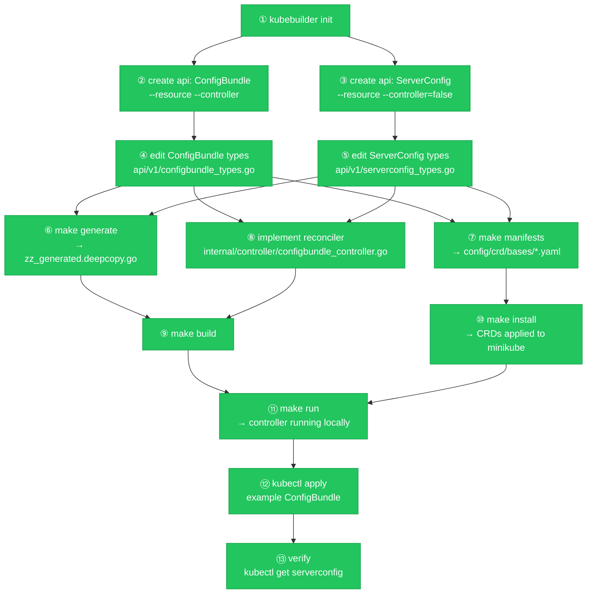

# Scaffold Execution Plan: ConfigBundle CRD + Controller

**Status:** Ready to execute  
**Last updated:** 2026-05-26  
**Executor:** Sonnet  
**Design input:** [002-crd-design-server.md](002-crd-design-server.md)

---

## Goal

By the end of this plan:
- `make generate` and `make manifests` run without error
- `make install` applies ConfigBundle and ServerConfig CRDs to minikube
- `make run` starts the ConfigBundle Controller locally against minikube
- `kubectl apply` of an example ConfigBundle CR (1 server) triggers the controller to create a child ServerConfig CR

---

## DAG



---

## Prerequisites

Verify all of these before starting:

```bash
go version          # 1.25+
kubebuilder version # v4.x
minikube version    # any recent
kubectl version     # matches minikube
kustomize version   # or let Makefile download it
```

Working directory for all commands: `~/armada/configbundle`

---

## Phase 1 — Project scaffold

### ① kubebuilder init

```bash
kubebuilder init \
  --domain armada.ai \
  --repo github.com/armada/configbundle \
  --plugins go/v4
```

Creates: `go.mod`, `Makefile`, `PROJECT`, `config/`, `cmd/main.go`, `internal/`, `.golangci.yml`

### ② Create ConfigBundle API + controller scaffold

```bash
kubebuilder create api \
  --group "" \
  --version v1 \
  --kind ConfigBundle \
  --resource \
  --controller
```

When prompted: answer `y` to both resource and controller creation.

> **If kubebuilder rejects `--group ""`:** use `--group armada` and `--domain ai` instead. This changes the Go package path to `api/armada/v1/`. After generation, move the package: `mv api/armada/v1 api/v1` and update the import path in all generated files from `github.com/armada/configbundle/api/armada/v1` to `github.com/armada/configbundle/api/v1`.

Creates:
- `api/v1/configbundle_types.go` (stub — replace contents in step ④)
- `api/v1/groupversion_info.go`
- `internal/controller/configbundle_controller.go` (stub — replace contents in step ⑧)
- `config/crd/`, `config/rbac/`, `config/samples/`

### ③ Create ServerConfig API (types only, no controller)

```bash
kubebuilder create api \
  --group "" \
  --version v1 \
  --kind ServerConfig \
  --resource \
  --controller=false
```

When prompted: answer `y` to resource creation.

Creates:
- `api/v1/serverconfig_types.go` (stub — replace contents in step ⑤)

---

## Phase 2 — Type definitions

### ④ Replace ConfigBundle types

Replace the entire contents of `api/v1/configbundle_types.go` with:

```go
package v1

import (
	metav1 "k8s.io/apimachinery/pkg/apis/meta/v1"
)

// IdracSpec holds desired iDRAC configuration, sourced from Orbital IdracSettings.
// All fields are desired state — not observed state. The ServerConfig controller
// actuates these via Redfish PATCH calls to the OOB IP.
type IdracSpec struct {
	// FirmwareVersion is the desired iDRAC firmware version (e.g. "7.20.10.05").
	// Controller reads current version via Redfish GET and upgrades/downgrades to match.
	// +optional
	FirmwareVersion string `json:"firmwareVersion,omitempty"`

	// +optional
	SSHEnabled bool `json:"sshEnabled,omitempty"`

	// +optional
	IPMIEnabled bool `json:"ipmiEnabled,omitempty"`

	// +optional
	LockdownModeEnabled bool `json:"lockdownModeEnabled,omitempty"`

	// +optional
	OsToIdracPassThroughEnabled bool `json:"osToIdracPassThroughEnabled,omitempty"`

	// +optional
	UsbManagementPortEnabled bool `json:"usbManagementPortEnabled,omitempty"`

	// +optional
	DHCPEnabled bool `json:"dhcpEnabled,omitempty"`

	// +optional
	RacadmEnabled bool `json:"racadmEnabled,omitempty"`
}

// ServerSpec describes one server's desired configuration within a ConfigBundle.
type ServerSpec struct {
	// ServiceTag is the Dell hardware service tag (e.g. "3RK3V64").
	// Used as the identity key. The child ServerConfig CR is named strings.ToLower(ServiceTag).
	// +kubebuilder:validation:Required
	ServiceTag string `json:"serviceTag"`

	// Hostname is the server's hostname. Mandatory — the bundler skips servers without one.
	// +kubebuilder:validation:Required
	Hostname string `json:"hostname"`

	// OobIP is the out-of-band management (iDRAC) IP address.
	// The ServerConfig controller sends Redfish calls here. Mandatory for actuation.
	// +kubebuilder:validation:Required
	OobIP string `json:"oobIP"`

	// Idrac holds desired iDRAC configuration.
	// +optional
	Idrac IdracSpec `json:"idrac,omitempty"`
}

// ConfigBundleSpec holds the full intended configuration for a datacenter.
// The ConfigBundle controller decomposes this into domain child CRs via SSA.
type ConfigBundleSpec struct {
	// Datacenter is the identifier of the target datacenter (matches Orbital namespace name).
	// +kubebuilder:validation:Required
	Datacenter string `json:"datacenter"`

	// Servers is the list of server configurations for this datacenter.
	// +optional
	Servers []ServerSpec `json:"servers,omitempty"`
}

// ConfigBundlePhase represents the current lifecycle phase.
// +kubebuilder:validation:Enum=Pending;Applying;Applied;Failed
type ConfigBundlePhase string

const (
	ConfigBundlePhasePending  ConfigBundlePhase = "Pending"
	ConfigBundlePhaseApplying ConfigBundlePhase = "Applying"
	ConfigBundlePhaseApplied  ConfigBundlePhase = "Applied"
	ConfigBundlePhaseFailed   ConfigBundlePhase = "Failed"
)

// ConfigBundleStatus records the controller's observed state.
type ConfigBundleStatus struct {
	// Phase is the current lifecycle phase.
	// +optional
	Phase ConfigBundlePhase `json:"phase,omitempty"`

	// Conditions records detailed status conditions using the standard K8s convention.
	// +optional
	// +listType=map
	// +listMapKey=type
	Conditions []metav1.Condition `json:"conditions,omitempty"`

	// LastAppliedDigest is the OCI artifact digest last successfully applied.
	// The controller skips re-processing when the current artifact digest matches this value.
	// +optional
	LastAppliedDigest string `json:"lastAppliedDigest,omitempty"`

	// LastAppliedAt is the time the last successful apply completed.
	// +optional
	LastAppliedAt *metav1.Time `json:"lastAppliedAt,omitempty"`
}

// +kubebuilder:object:root=true
// +kubebuilder:subresource:status
// +kubebuilder:resource:scope=Namespaced,shortName=cb
// +kubebuilder:printcolumn:name="Datacenter",type=string,JSONPath=`.spec.datacenter`
// +kubebuilder:printcolumn:name="Phase",type=string,JSONPath=`.status.phase`
// +kubebuilder:printcolumn:name="Age",type=date,JSONPath=`.metadata.creationTimestamp`

// ConfigBundle is the top-level CR for a datacenter's intended configuration.
// The ConfigBundle controller decomposes its spec into domain child CRs (ServerConfig, etc.)
// using Server-Side Apply with field manager "configbundle-controller".
type ConfigBundle struct {
	metav1.TypeMeta   `json:",inline"`
	metav1.ObjectMeta `json:"metadata,omitempty"`

	Spec   ConfigBundleSpec   `json:"spec,omitempty"`
	Status ConfigBundleStatus `json:"status,omitempty"`
}

// +kubebuilder:object:root=true

// ConfigBundleList contains a list of ConfigBundle.
type ConfigBundleList struct {
	metav1.TypeMeta `json:",inline"`
	metav1.ListMeta `json:"metadata,omitempty"`
	Items           []ConfigBundle `json:"items"`
}

func init() {
	SchemeBuilder.Register(&ConfigBundle{}, &ConfigBundleList{})
}
```

### ⑤ Replace ServerConfig types

Replace the entire contents of `api/v1/serverconfig_types.go` with:

```go
package v1

import (
	metav1 "k8s.io/apimachinery/pkg/apis/meta/v1"
)

// ServerConfigSpec mirrors the ServerSpec from ConfigBundle.
// The ConfigBundle controller creates and updates this CR via SSA.
// Local admins may override individual fields using field manager "local:<admin-id>".
type ServerConfigSpec struct {
	// ServiceTag is the original-case Dell service tag (e.g. "3RK3V64").
	// Repeated here (vs. deriving from CR name) so the controller has it without string manipulation.
	// +kubebuilder:validation:Required
	ServiceTag string `json:"serviceTag"`

	// Hostname is the server's hostname for display and logging.
	// +kubebuilder:validation:Required
	Hostname string `json:"hostname"`

	// OobIP is the iDRAC management IP. The ServerConfig controller targets Redfish here.
	// +kubebuilder:validation:Required
	OobIP string `json:"oobIP"`

	// Idrac holds desired iDRAC configuration.
	// +optional
	Idrac IdracSpec `json:"idrac,omitempty"`
}

// ServerConfigPhase represents the current lifecycle phase.
// +kubebuilder:validation:Enum=Pending;Applied;Diverged
type ServerConfigPhase string

const (
	ServerConfigPhasePending  ServerConfigPhase = "Pending"
	ServerConfigPhaseApplied  ServerConfigPhase = "Applied"
	ServerConfigPhaseDiverged ServerConfigPhase = "Diverged"
)

// ServerConfigStatus records the controller's observed state.
type ServerConfigStatus struct {
	// Phase is the current lifecycle phase.
	// +optional
	Phase ServerConfigPhase `json:"phase,omitempty"`

	// Conditions records detailed status conditions.
	// +optional
	// +listType=map
	// +listMapKey=type
	Conditions []metav1.Condition `json:"conditions,omitempty"`

	// ObservedFirmwareVersion is the firmware version read from Redfish at last reconcile.
	// +optional
	ObservedFirmwareVersion string `json:"observedFirmwareVersion,omitempty"`
}

// +kubebuilder:object:root=true
// +kubebuilder:subresource:status
// +kubebuilder:resource:scope=Namespaced,shortName=sc
// +kubebuilder:printcolumn:name="ServiceTag",type=string,JSONPath=`.spec.serviceTag`
// +kubebuilder:printcolumn:name="Hostname",type=string,JSONPath=`.spec.hostname`
// +kubebuilder:printcolumn:name="OobIP",type=string,JSONPath=`.spec.oobIP`
// +kubebuilder:printcolumn:name="Phase",type=string,JSONPath=`.status.phase`
// +kubebuilder:printcolumn:name="Age",type=date,JSONPath=`.metadata.creationTimestamp`

// ServerConfig is a domain child CR owned by a ConfigBundle.
// Created and updated by the ConfigBundle Controller via SSA (field manager: "configbundle-controller").
// The ServerConfig Controller (separate, out of scope for v1) actuates the spec via Redfish.
type ServerConfig struct {
	metav1.TypeMeta   `json:",inline"`
	metav1.ObjectMeta `json:"metadata,omitempty"`

	Spec   ServerConfigSpec   `json:"spec,omitempty"`
	Status ServerConfigStatus `json:"status,omitempty"`
}

// +kubebuilder:object:root=true

// ServerConfigList contains a list of ServerConfig.
type ServerConfigList struct {
	metav1.TypeMeta `json:",inline"`
	metav1.ListMeta `json:"metadata,omitempty"`
	Items           []ServerConfig `json:"items"`
}

func init() {
	SchemeBuilder.Register(&ServerConfig{}, &ServerConfigList{})
}
```

---

## Phase 3 — Generate and verify build

### ⑥ Generate DeepCopy methods

```bash
make generate
```

Produces `api/v1/zz_generated.deepcopy.go`. Never hand-edit this file.

### ⑦ Generate CRD manifests

```bash
make manifests
```

Produces CRD YAML in `config/crd/bases/`:
- `armada.ai_configbundles.yaml`
- `armada.ai_serverconfigs.yaml`

Inspect one to verify structure:

```bash
cat config/crd/bases/armada.ai_configbundles.yaml | grep -A5 "serviceTag"
```

---

## Phase 4 — Controller implementation

### ⑧ Replace controller

Replace the entire contents of `internal/controller/configbundle_controller.go` with:

```go
package controller

import (
	"context"
	"strings"

	metav1 "k8s.io/apimachinery/pkg/apis/meta/v1"
	"k8s.io/apimachinery/pkg/runtime"
	ctrl "sigs.k8s.io/controller-runtime"
	"sigs.k8s.io/controller-runtime/pkg/client"
	"sigs.k8s.io/controller-runtime/pkg/log"

	armadav1 "github.com/armada/configbundle/api/v1"
)

// ConfigBundleReconciler reconciles a ConfigBundle object.
type ConfigBundleReconciler struct {
	client.Client
	Scheme *runtime.Scheme
}

// +kubebuilder:rbac:groups=armada.ai,resources=configbundles,verbs=get;list;watch;create;update;patch;delete
// +kubebuilder:rbac:groups=armada.ai,resources=configbundles/status,verbs=get;update;patch
// +kubebuilder:rbac:groups=armada.ai,resources=configbundles/finalizers,verbs=update
// +kubebuilder:rbac:groups=armada.ai,resources=serverconfigs,verbs=get;list;watch;create;update;patch;delete

func (r *ConfigBundleReconciler) Reconcile(ctx context.Context, req ctrl.Request) (ctrl.Result, error) {
	log := log.FromContext(ctx)

	var cb armadav1.ConfigBundle
	if err := r.Get(ctx, req.NamespacedName, &cb); err != nil {
		return ctrl.Result{}, client.IgnoreNotFound(err)
	}

	log.Info("reconciling ConfigBundle", "name", cb.Name, "servers", len(cb.Spec.Servers))

	for _, server := range cb.Spec.Servers {
		if err := r.applyServerConfig(ctx, &cb, server); err != nil {
			log.Error(err, "failed to apply ServerConfig", "serviceTag", server.ServiceTag)
			return ctrl.Result{}, err
		}
		log.Info("applied ServerConfig", "name", strings.ToLower(server.Hostname))
	}

	return ctrl.Result{}, nil
}

// applyServerConfig creates or updates a ServerConfig CR for the given server
// using Server-Side Apply with field manager "configbundle-controller".
func (r *ConfigBundleReconciler) applyServerConfig(ctx context.Context, cb *armadav1.ConfigBundle, server armadav1.ServerSpec) error {
	sc := &armadav1.ServerConfig{
		TypeMeta: metav1.TypeMeta{
			APIVersion: armadav1.GroupVersion.String(),
			Kind:       "ServerConfig",
		},
		ObjectMeta: metav1.ObjectMeta{
			Name:      strings.ToLower(server.Hostname),
			Namespace: cb.Namespace,
		},
		Spec: armadav1.ServerConfigSpec{
			ServiceTag: server.ServiceTag,
			Hostname:   server.Hostname,
			OobIP:      server.OobIP,
			Idrac:      server.Idrac,
		},
	}

	if err := ctrl.SetControllerReference(cb, sc, r.Scheme); err != nil {
		return err
	}

	return r.Patch(ctx, sc, client.Apply,
		client.FieldOwner("configbundle-controller"),
		client.ForceOwnership,
	)
}

// SetupWithManager registers the controller with the manager.
// Owns(ServerConfig) ensures changes to child CRs re-trigger reconciliation of the parent.
func (r *ConfigBundleReconciler) SetupWithManager(mgr ctrl.Manager) error {
	return ctrl.NewControllerManagedBy(mgr).
		For(&armadav1.ConfigBundle{}).
		Owns(&armadav1.ServerConfig{}).
		Complete(r)
}
```

### ⑨ Verify build

```bash
make build
```

This must compile without errors before proceeding. Fix any import or type errors here.

---

## Phase 5 — Deploy and verify

> **Prerequisite:** minikube is running and kubeconfig is set to the minikube context before running these steps.

### ⑩ Install CRDs to minikube

```bash
make install
```

Verify CRDs are registered:

```bash
kubectl get crd configbundles.armada.ai
kubectl get crd serverconfigs.armada.ai
```

### ⑪ Run controller locally

In a dedicated terminal (keep it running):

```bash
make run
```

Expected output: controller starts, logs `starting manager`, no errors.

### ⑫ Apply example ConfigBundle

In a second terminal:

```bash
kubectl create namespace configbundle-system
kubectl apply -f config/samples/example-configbundle.yaml
```

Where `config/samples/example-configbundle.yaml` contains:

```yaml
apiVersion: armada.ai/v1
kind: ConfigBundle
metadata:
  name: colo-galleon
  namespace: configbundle-system
spec:
  datacenter: colo
  servers:
    - serviceTag: 3RK3V64
      hostname: colo-r740-01
      oobIP: 10.10.1.45
      idrac:
        firmwareVersion: "7.20.10.05"
        sshEnabled: false
        ipmiEnabled: false
        lockdownModeEnabled: false
        osToIdracPassThroughEnabled: false
        usbManagementPortEnabled: true
        dhcpEnabled: false
        racadmEnabled: true
```

### ⑬ Verify decomposition

```bash
# Child CR created by controller
kubectl get serverconfig -n configbundle-system

# Expected output:
# NAME           SERVICETAG   HOSTNAME       OOBIP        PHASE   AGE
# colo-r740-01   3RK3V64      colo-r740-01   10.10.1.45           5s

# Inspect the child CR
kubectl describe serverconfig colo-r740-01 -n configbundle-system

# Verify ownerReference points to the parent ConfigBundle
kubectl get serverconfig colo-r740-01 -n configbundle-system -o jsonpath='{.metadata.ownerReferences}'

# Verify managedFields are owned by configbundle-controller
kubectl get serverconfig colo-r740-01 -n configbundle-system -o jsonpath='{.metadata.managedFields[*].manager}'
```

---

## Common failure modes

| Symptom | Cause | Fix |
|---|---|---|
| `make generate` fails with "controller-gen not found" | Binary not installed | Run `make generate` once — Makefile auto-downloads it to `./bin/` |
| `make manifests` produces empty CRD fields | Struct missing `json` tags | Check type definitions have all `json:"..."` tags |
| `make build` fails with import errors | Package path mismatch if `--group ""` was rejected | Verify import is `github.com/armada/configbundle/api/v1` in controller file |
| `make install` fails with "connection refused" | minikube not running | `minikube start` |
| Controller starts but no ServerConfig created | Namespace mismatch or RBAC | Confirm ConfigBundle is in `configbundle-system`; check controller logs |
| `SSA patch` fails with "managed field conflict" | Field manager collision | Check `client.ForceOwnership` is passed to `r.Patch` |
