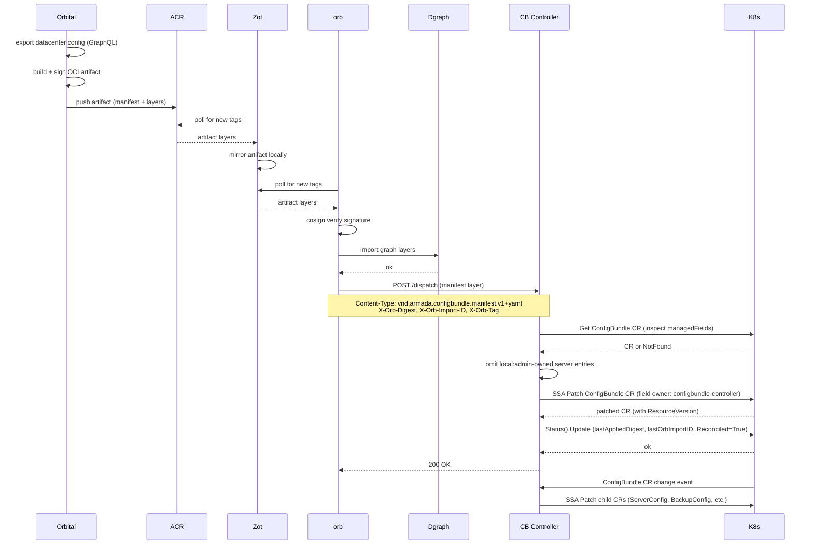

# Edge Reference

> **When to load this file:** Read this before working on the ConfigBundle Controller's consume pipeline (HTTP handler, SSA apply, status update), divergence reporting, or the edge registry (Zot).

---

## Overview

There is no separate edge agent binary. The ConfigBundle Controller is a passive consumer: it does not poll Zot, does not pull OCI artifacts, and does not call orb's import API. Instead, orb's dispatch pipeline handles all OCI mechanics (poll Zot, cosign verify, graph import) and then POSTs the manifest layer bytes to the ConfigBundle Controller via `POST /dispatch`. The ConfigBundle Controller receives the manifest, applies the ConfigBundle CR via SSA (respecting local admin overrides), and updates status.

---

## End-to-end dispatch flow

---

## Settled Decisions

- **No separate edge agent** — the ConfigBundle Controller, ConsumeServer, and Divergence Reporter are all part of the same binary on the Mgmt Cluster. Do not create an `edge-agent` binary.
- **Single dispatch endpoint, content-routed** — `POST /dispatch` is the only inbound HTTP endpoint. Only `manifest.v1+yaml` is accepted; any other Content-Type returns 415. Do NOT add `/consume` or `/mapping` back.
- **No mapping layer** — orbIds are saturated on the CR (see CRD.md). The bundler returns a single OCI layer (manifest only). The `<cb-name>-mapping` ConfigMap is kept by name for backward compatibility but only holds `last-applied-spec.yaml`.
- **CB Controller is a passive consumer** — never polls Zot, never pulls OCI artifacts, never calls cosign. Orb owns the full OCI pipeline. CB Controller never needs OCI credentials.
- **If orb is down, CB Controller receives no updates until orb recovers and re-dispatches** — no fallback polling.
- **`configbundle-controller` field manager owns everything the controller writes.** Local admin overrides use `local:admin`, ONLY on the ConfigBundle CR — never on child CRs. Child CRs are derived state; Decomposition Reconciler applies them WITH `ForceOwnership`.
- **Divergence is data, not an error** — a disconnected Galleon that hasn't received a dispatch is in a valid (diverged) state. Never block or error on lack of convergence.
- **Divergence Reporter fires on `local:*` managedFields change only** — the predicate ignores spec-only changes. Quiet-state: zero reconciles, zero POSTs to orb.
- **`omitAdminOwnedFields` is mandatory in the consume path.** ConsumeServer inspects `managedFields` and, for each `local:*`-owned leaf, KEEPs it in the apply body when the value matches intent or the field is in `spec.takeover[]` (force-claim evicts local:*), OMITs it when values differ and there's no takeover (bow out; local:* retains). Skipping this steals ownership via `ForceOwnership` and breaks the divergence loop. No steady-state co-ownership on value fields.
- **Divergence `when` uses `managedFields[].time` directly** — no annotation tracking. Orbital's `DivergenceEntry.first_seen_at` is the stable first-seen surfaced in the UI.
- **Takeover is a second pass in the consume handler, and runs regardless of normal-apply success.** Cloud admin's force decision must not be blocked by an unrelated 409 on another field. The consume handler does NOT mutate `spec.takeover[]` — entries persist until the next bundle naturally replaces them (cb-bundler flips `DivergenceResolution.cb_consumed = true` after push).
- **Every takeover ends with a release-of-other-claims pass via SSA-as-manager.** cb-controller submits an SSA apply as the other manager, omitting the takeover-target fields — SSA's release-on-omit strips just those claims. When every claim a manager held was a takeover target on one entry, the whole entry is omitted from the release body (else the residual `{orbId: X}` leaves a false-positive audit signal). When `newSpec` is empty, `spec` is omitted from the Apply body entirely. Do NOT edit `managedFields` directly — K8s docs warn against it; SSA-as-manager is the intended protocol.
- **Ignore lives in `spec.ignored[]`, not as bundler value-omission.** Intent values stay in spec so divergence-reporter can compare, and overrides remain visible to the operator instead of silently muted.
- **Local release of a local:* claim auto-reverts to last-imported intent.** ReclaimController watches managedFields; when a field had a local:* claim and now has none (release, not rotation), it replays the last-imported manifest from the `<cb>-mapping` ConfigMap. Applies regardless of `spec.ignored[]` membership.
- **`spec.ignored[]` only carries entries with an active local:* claim.** `applyManifest` scrubs stale entries via `collectLocalClaimedKeys` + `filterActiveIgnored`. Do NOT reinstate the earlier defensive Ignored sweep on non-claimed fields — it produced orphan state (no claim, value ≠ intent) and was replaced by the reclaim path.

---

## ConfigBundle Controller — full responsibility list

The controller is a single binary (Mgmt Cluster) with multiple goroutines managed by controller-runtime:

### ConsumeServer (`ctrl.Runnable`) — HTTP-driven, not time-driven

`NeedsLeaderElection() = false` — all replicas serve (applies are idempotent via SSA).

Listens on `CB_CONTROLLER_PORT` (default `:8095`).

**`POST /dispatch`** — single endpoint, routes by `Content-Type`:

| Content-Type | Action |
|---|---|
| `application/vnd.armada.configbundle.manifest.v1+yaml` | Apply ConfigBundle CR via SSA |
| anything else | `415 Unsupported Media Type` |

`X-Orb-Digest` is required (400 if absent). `X-Orb-Import-ID` and `X-Orb-Tag` are read for traceability.

**Manifest apply pipeline (in order):**
1. **Parse manifest** bytes into ConfigBundle CR spec fields
2. **Mark in-flight** so ReclaimController defers if a release event fires mid-apply
3. **Update in-memory `lastManifest`** BEFORE any K8s write (source-of-truth for reclaim replay)
4. **Fetch current CR** and inspect `managedFields` — identify fields owned by `local:*` managers
5. **`filterActiveIgnored`** — drop `spec.ignored[]` entries whose target field has no active `local:*` claim (ADR-009 invariant)
6. **`omitAdminOwnedFields`** — strip "bow-out" leaves: `local:*`-owned fields where intent value differs from live value AND the field isn't in `spec.takeover[]`. Values-match fields stay in the apply and get force-claimed below (no steady-state co-ownership)
7. **SSA patch** with `ForceOwnership`, field manager `configbundle-controller`. See `CRD.md` § SSA conflict resolution
8. **`processTakeover`** — for each `spec.takeover[]` entry, submit a narrow SSA apply with `ForceOwnership` reclaiming that field from `local:admin` (ADR-006). Runs regardless of step 7 success
9. **Write `<cb-name>-mapping` ConfigMap** — persist `last-applied-spec.yaml` under this CM (OwnerReference to the CR, `controller: true`). Same CM name as pre-ADR-011 for backward compatibility; the old `mapping.json` key is scrubbed if present
10. **Update ConfigBundle CR status** (status subresource): `lastAppliedDigest` (`X-Orb-Digest`), `lastOrbImportID` (`X-Orb-Import-ID`), `lastAppliedAt`, `Reconciled=True` condition

**Response codes:**
- `200` — applied successfully
- `400` — missing `X-Orb-Digest` or malformed manifest
- `415` — unknown Content-Type
- `500` — apply failed; orb records failure and may retry

### Decomposition Reconciler (`ctrl.Reconciler`) — event-driven, triggered by ConfigBundle CR changes
1. **Decompose ConfigBundle CR** into domain child CRs (ServerConfig, BackupConfig) via SSA WITH `ForceOwnership` — child CRs faithfully reflect the ConfigBundle CR
2. **Set OwnerReferences** on child CRs so deletion cascades when ConfigBundle is deleted
3. **Update ConfigBundle CR status**: `phase`, `Reconciled` condition, `observedGeneration`

### Divergence Reporter (`ctrl.Reconciler`) — event-driven with debounce + heartbeat + bootstrap
1. **Predicate fires on `local:*` managedFields change** — compares `FieldsV1.Raw` bytes for any `local:*` manager between old and new CR; non-local changes are ignored
2. **Debounce:** `lastEventAt[key]` set on predicate match; reconciler returns `RequeueAfter(remaining)` until `DIVERGENCE_REPORTER_DEBOUNCE` (default `5s`) of quiet time has elapsed
3. **Compute overrides** from current CR's `managedFields` vs last-applied spec (in-memory `lastManifests`, bootstrapped from the per-CR ConfigMap). orbIDs are walked directly from the spec (no mapping layer) — the CR itself is the identity manifest
4. **Cold-start guard for intent:** if `lastManifests[cb.Name]` has no entry (controller hasn't seen a manifest dispatch for this CR yet), **skip the POST** — posting nil would wipe orb's store (replace-not-merge). Wait for next bundle dispatch to populate intent, OR for the bootstrap loader to rehydrate from the persisted ConfigMap
5. **Content-hash dedup (from CR status):** SHA-256 hex of the canonical payload; if `cb.Status.DivergenceReporting.LastPostedHash` matches, skip the POST — orb already has this exact payload
6. **Steady-state quiet:** if `overrides=0` AND `LastPostedOverrideCount` is non-nil and `*0`, skip the POST — the last POST was also empty, orb's view doesn't need refreshing. The pointer-int distinction is load-bearing: `nil` (never posted) forces a POST; `*0` (posted empty) allows the skip. This closes the earlier cold-start bug where an empty in-memory map silently claimed "last post was empty" after a restart
7. **POST the full override set** to orb's divergence intake (`ORB_DIVERGENCE_INTAKE_URL`) — replace-not-merge semantics; exponential backoff via controller-runtime work queue on error
8. **Persist dedup state** to `cb.Status.DivergenceReporting` (via `Status().Update` + `RetryOnConflict`) so a restarted reporter reads correct dedup state on cold start

#### Restart durability — resilient-not-stateless

The reporter is designed to be *resilient* (recovers to correct state on restart), not *stateless* in the strict sense. Two categories of state:

**Domain state (durable, in Kubernetes)**
- `lastManifests` (intent baseline) — persisted per-CB in `<cb-name>-mapping` ConfigMap under `last-applied-spec.yaml`. Rehydrated on startup by `lastManifestLoader`.
- `cb.Status.DivergenceReporting.{LastPostedAt, LastPostedHash, LastPostedOverrideCount}` — persisted on the CR's status subresource after every successful POST. Read fresh on every reconcile via the informer cache.

**Ephemeral state (in-memory, purely operational)**
- `lastEventAt` (debounce timers) — per-process; loss = extra fraction of debounce
- `inFlight` in ConsumeServer (reclaim race guard) — inherently per-process

Two historical failure modes and how each is now closed:

| Failure | How it's handled |
|---|---|
| **Controller restart loses intent baseline** | Bootstrap rehydrates `lastManifests` from per-CR ConfigMap on startup. Cold-start intent guard (step 4) skips POST if rehydration failed |
| **orb store wiped (PVC failure, fresh edge)** | Heartbeat clears `cb.Status.DivergenceReporting.LastPostedHash` for CBs with `local:*` claims; next reconcile computes fresh hash, sees mismatch, re-POSTs. Bounds recovery latency to one heartbeat interval |
| **Controller restart mid-flow through takeover** (fixed by moving dedup state to CR status) | On restart, `cb.Status.DivergenceReporting` is either nil (unknown — force POST) or populated (known — trust it). Neither state can silently degrade to the "was empty last time" default that the earlier in-memory design collapsed to on cold start |

#### Design note: why `LastPostedOverrideCount` is a pointer

The pointer-int distinguishes three states cleanly:
- `nil` → never posted (or CRD upgrade wrote nil, or manual clear) → treat as unknown; POST on next reconcile regardless
- `*0` → last POST was empty → steady-state quiet may skip
- `*N` (N > 0) → last POST had N overrides → transitions to empty must POST

Using a plain `int` would collapse `nil` and `*0` into the same value (`0`), which is exactly the bug the earlier in-memory `map[key]bool` design had. Go's zero-value defaults for missing keys are a cache-miss lie: `false` (or `0`) reads the same whether the state is "we haven't decided yet" or "we decided no last time." The pointer forces callers to distinguish.

---

## Environment variables (ConfigBundle Controller)

| Variable | Default | Description |
|---|---|---|
| `CB_CONTROLLER_PORT` | `:8095` | Listen address for `POST /dispatch` (ConsumeServer) |
| `ORB_DIVERGENCE_INTAKE_URL` | `http://localhost:8010/api/v1/divergence` | Where the Divergence Reporter POSTs override entries |
| `DIVERGENCE_REPORTER_DEBOUNCE` | `5s` | Quiet window after last `local:*` managedFields change before reporting |
| `DIVERGENCE_REPORTER_HEARTBEAT` | `5m` | Periodic re-send interval. On each tick, clears `cb.Status.DivergenceReporting.LastPostedHash` on CBs with `local:*` claims and triggers reconcile. Bounds recovery latency for the "orb wipe" failure mode. Set `0` to disable. |
| `DIVERGENCE_REPORTER_ENABLED` | `true` | Set `false` to disable all divergence POSTs (local dev without orb) |
| `NAMESPACE` | `default` | Namespace the ConsumeServer watches for ConfigBundle CRs |

---

## Divergence tracking

- The Divergence Reporter inspects `managedFields` on the **ConfigBundle CR only** — not child CRs
- Fields owned by `local:*` (typically `local:admin`) on the ConfigBundle CR are local overrides
- Divergence report contains: field path, intended value, override value, orbId of the owning ConfigItem (walked directly from the spec — no mapping layer), who (`local:admin`), when (`managedFields[].time`)
- Reports POSTed to orb's divergence intake (`ORB_DIVERGENCE_INTAKE_URL`) — orb relays to S3 for orbital ingestion
- Each POST is a full replace-not-merge snapshot — if a field is no longer owned by `local:*`, it disappears from the next report
- `overrides: []` is valid and means "no local overrides" — orbital interprets this as all divergence resolved. Steady-state quiet: reporter skips the POST if `cb.Status.DivergenceReporting.LastPostedOverrideCount` is non-nil and `*0` (previous POST was also empty)
- A Galleon with no dispatches from orb (disconnected) still publishes divergence reports — time since last apply is tracked
- **Prerequisite:** `servers[]` has `+listType=map +listMapKey=orbId` (post-ADR-011) so SSA tracks per-entry field ownership

---

## Gotchas

- **`DIVERGENCE_REPORTER_INTERVAL` / `DIVERGENCE_REPORTER_SCHEDULE` no longer exist** — replaced by `DIVERGENCE_REPORTER_DEBOUNCE` (default `5s`). The reporter is event-driven, not ticker-driven.
- **omitAdminOwnedFields is mandatory in the dispatch/manifest path** — skipping it steals ownership from `local:*` managers via the ForceOwnership apply and breaks the divergence loop.
- **CB Controller never needs OCI credentials** — orb handles all OCI mechanics including cosign verification.
- **If orb is down, CB Controller receives no updates until orb recovers and re-dispatches** — no fallback polling.
- **Local overrides are at ConfigBundle CR level only** — do not implement or support `local:*` field managers on child CRs (ServerConfig, BackupConfig, etc.). Child CRs are derived state.
- **Decomposition Reconciler MUST use ForceOwnership on child CRs** — child CRs always reflect the ConfigBundle CR faithfully. There is no case where a child CR field should diverge from what the ConfigBundle CR says.
- **Divergence tracking is on ConfigBundle CR managedFields only** — do not inspect child CR managedFields for divergence. The ConfigBundle CR is the single source of divergence truth.
- **Decomposition must be idempotent** — applying the same ConfigBundle manifest twice must produce the same child CRs with no side effects. SSA guarantees this if field managers are used correctly.
- **Return 500 on apply failure** — a 500 response is visible in orb's import history, giving operators a clear audit trail.
- **Wrap `Status().Update`/`Status().Patch` and spec writes on owned objects in `retry.RetryOnConflict`** — multiple writers race the same resourceVersion (ConsumeServer ↔ ConfigBundleReconciler's `ObservedGeneration` write is the canonical case).

---

## External references

- [OCI artifact layer reference](./BUNDLE.md)
- [ConfigBundle CR structure](./CRD.md)
- [Local override / divergence model](./ORBITAL.md)

---

## Domain file maintenance

Update this file when:
- The ConsumeServer HTTP interface changes (headers, response codes, endpoint path)
- The apply pipeline steps change
- The divergence report format or transport is finalized
- Environment variables are added or renamed

Updates must be in the same PR as the code change that prompted them.
